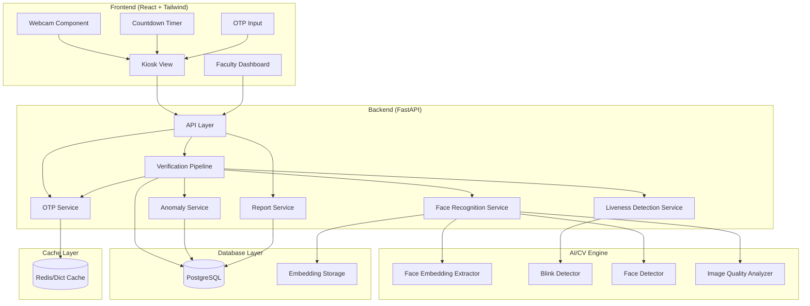
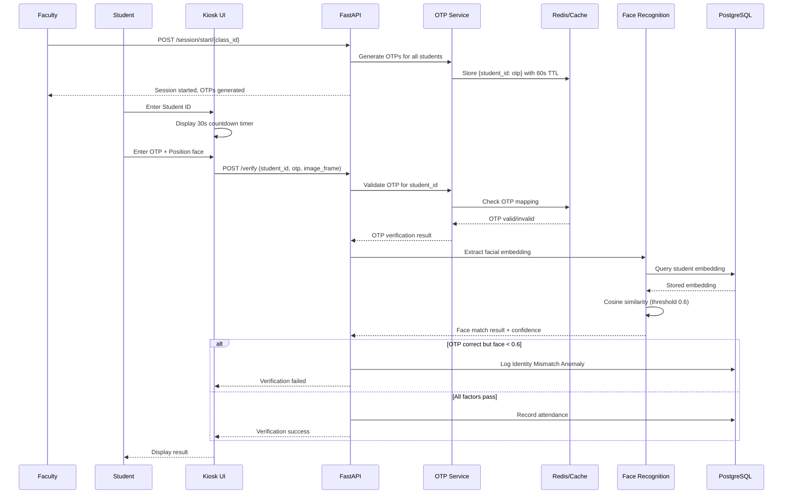

# Design Document

## Overview

The Intelligent Student Attendance Verification System (ISAVS) is a full-stack EdTech application that implements secure, tamper-resistant student attendance through Multi-Factor Verification with Geofencing. The system combines Face Recognition, ID Validation, OTP Verification, and Location Verification to prevent proxy attendance.

The 2026 upgrade includes:
- **Modern MediaPipe Tasks API** (vision.FaceLandmarker) replacing deprecated mp.solutions
- **CLAHE Preprocessing** for robust recognition in uneven lighting
- **Centroid Enrollment** capturing 10 frames and storing mean embedding
- **Geofencing** with 50-meter radius verification using Haversine formula
- **WebSocket Real-time Sync** for instant dashboard updates

The architecture follows a client-server model with:
- **Backend**: Python FastAPI server handling verification logic and data persistence
- **AI/CV Engine**: OpenCV, face_recognition (dlib-based), and MediaPipe Tasks API for facial processing
- **Database**: PostgreSQL for relational data, with facial embeddings stored as vectors
- **Frontend**: React.js with Tailwind CSS for the Kiosk and Dashboard interfaces
- **Real-time Layer**: WebSocket (Socket.io) for live dashboard updates

## Architecture



### System Flow



## Components and Interfaces

### Backend Components

#### 1. API Layer (`app/api/`)

```python
# Endpoint interfaces
class EnrollRequest(BaseModel):
    name: str
    student_id_card_number: str
    # No face_image - will capture 10 frames via video stream

class EnrollResponse(BaseModel):
    success: bool
    student_id: Optional[int]
    frames_captured: int
    centroid_computed: bool
    message: str

class StartSessionRequest(BaseModel):
    class_id: str
    classroom_latitude: float
    classroom_longitude: float

class StartSessionResponse(BaseModel):
    success: bool
    session_id: str
    otp_count: int
    expires_at: datetime
    geofence_center: Dict[str, float]  # {"lat": x, "lon": y}
    message: str

class VerifyRequest(BaseModel):
    student_id: str
    otp: str  # 4-digit OTP
    face_image: str  # Base64 encoded frame
    latitude: float
    longitude: float

class VerifyResponse(BaseModel):
    success: bool
    factors: FactorResults
    message: str
    attendance_id: Optional[int]

class FactorResults(BaseModel):
    face_verified: bool
    face_confidence: float
    liveness_passed: bool
    id_verified: bool
    otp_verified: bool
    geofence_verified: bool
    distance_meters: Optional[float]

class ResendOTPRequest(BaseModel):
    student_id: str
    session_id: str

class ResendOTPResponse(BaseModel):
    success: bool
    attempts_remaining: int
    expires_at: Optional[datetime]
    message: str

class ReportResponse(BaseModel):
    attendance_records: List[AttendanceRecord]
    proxy_alerts: List[ProxyAlert]
    identity_mismatch_alerts: List[IdentityMismatchAlert]
    geofence_violations: List[GeofenceViolation]
    statistics: AttendanceStatistics

class WebSocketMessage(BaseModel):
    type: Literal['attendance_update', 'anomaly_alert']
    data: Dict[str, Any]
    timestamp: datetime
```

#### 2. Face Recognition Service (`app/services/face_recognition_service.py`)

```python
class FaceRecognitionService:
    def __init__(self):
        # Load MediaPipe Tasks API FaceLandmarker
        self.face_landmarker = self._load_face_landmarker()
    
    def _load_face_landmarker(self):
        """Load face_landmarker.task model file using MediaPipe Tasks API."""
        import mediapipe as mp
        from mediapipe.tasks import python
        from mediapipe.tasks.python import vision
        
        base_options = python.BaseOptions(model_asset_path='face_landmarker.task')
        options = vision.FaceLandmarkerOptions(base_options=base_options)
        return vision.FaceLandmarker.create_from_options(options)
    
    def extract_embedding(self, image: np.ndarray) -> Optional[np.ndarray]:
        """Extract 128-d facial embedding from preprocessed image."""
        pass
    
    def extract_centroid_embedding(self, frames: List[np.ndarray]) -> Optional[np.ndarray]:
        """Extract embeddings from 10 frames and compute mean centroid."""
        embeddings = []
        for frame in frames:
            embedding = self.extract_embedding(frame)
            if embedding is not None:
                embeddings.append(embedding)
        
        if len(embeddings) >= 5:  # Require at least 5 valid frames
            return np.mean(embeddings, axis=0)
        return None
    
    def compare_embeddings(self, embedding1: np.ndarray, embedding2: np.ndarray) -> float:
        """Calculate cosine similarity between two embeddings."""
        pass
    
    def find_matching_student(self, embedding: np.ndarray, threshold: float = 0.6) -> Optional[StudentMatch]:
        """Find student with matching facial embedding using 0.6 threshold."""
        pass
    
    def detect_faces(self, image: np.ndarray) -> List[FaceLocation]:
        """Detect all faces in image using MediaPipe FaceLandmarker and return bounding boxes."""
        pass
```

#### 2A. Preprocessing Service (`app/services/preprocess.py`)

```python
class PreprocessingService:
    def apply_clahe(self, image: np.ndarray) -> np.ndarray:
        """Apply CLAHE (Contrast Limited Adaptive Histogram Equalization) to improve recognition in uneven lighting."""
        gray = cv2.cvtColor(image, cv2.COLOR_BGR2GRAY)
        clahe = cv2.createCLAHE(clipLimit=2.0, tileGridSize=(8, 8))
        enhanced = clahe.apply(gray)
        return enhanced
    
    def preprocess_frame(self, frame: np.ndarray) -> np.ndarray:
        """Apply full preprocessing pipeline: CLAHE + Grayscale."""
        return self.apply_clahe(frame)
```

#### 3. Liveness Detection Service (`app/services/liveness_service.py`)

```python
class LivenessService:
    def __init__(self):
        self.eye_aspect_ratio_threshold: float = 0.25
        self.consecutive_frames: int = 3
    
    def detect_blink(self, frames: List[np.ndarray]) -> bool:
        """Detect eye blink across multiple frames."""
        pass
    
    def calculate_eye_aspect_ratio(self, eye_landmarks: np.ndarray) -> float:
        """Calculate EAR for blink detection."""
        pass
    
    def check_liveness(self, frames: List[np.ndarray]) -> LivenessResult:
        """Perform complete liveness check."""
        pass
```

#### 4. Image Quality Analyzer (`app/services/image_quality_service.py`)

```python
class ImageQualityService:
    def analyze_lighting(self, image: np.ndarray) -> LightingAnalysis:
        """Analyze image contrast and brightness."""
        pass
    
    def check_quality_threshold(self, image: np.ndarray) -> QualityResult:
        """Check if image meets minimum quality requirements."""
        pass
    
    def get_improvement_suggestions(self, analysis: LightingAnalysis) -> List[str]:
        """Generate user-friendly suggestions for improving conditions."""
        pass
```

#### 4A. Geofence Service (`app/services/geofence_service.py`)

```python
class GeofenceService:
    GEOFENCE_RADIUS_METERS = 50
    
    def calculate_distance(self, lat1: float, lon1: float, lat2: float, lon2: float) -> float:
        """Calculate distance between two GPS coordinates using Haversine formula."""
        from math import radians, sin, cos, sqrt, atan2
        
        R = 6371000  # Earth radius in meters
        
        lat1_rad = radians(lat1)
        lat2_rad = radians(lat2)
        delta_lat = radians(lat2 - lat1)
        delta_lon = radians(lon2 - lon1)
        
        a = sin(delta_lat / 2) ** 2 + cos(lat1_rad) * cos(lat2_rad) * sin(delta_lon / 2) ** 2
        c = 2 * atan2(sqrt(a), sqrt(1 - a))
        
        return R * c
    
    def verify_location(self, student_lat: float, student_lon: float, 
                       classroom_lat: float, classroom_lon: float) -> GeofenceResult:
        """Verify student is within 50 meters of classroom."""
        distance = self.calculate_distance(student_lat, student_lon, classroom_lat, classroom_lon)
        
        return GeofenceResult(
            within_geofence=distance <= self.GEOFENCE_RADIUS_METERS,
            distance_meters=distance,
            threshold_meters=self.GEOFENCE_RADIUS_METERS
        )
```

#### 5. Verification Pipeline (`app/services/verification_pipeline.py`)

```python
class VerificationPipeline:
    def __init__(
        self,
        face_service: FaceRecognitionService,
        liveness_service: LivenessService,
        quality_service: ImageQualityService,
        preprocess_service: PreprocessingService,
        geofence_service: GeofenceService,
        otp_service: OTPService
    ):
        pass
    
    def verify_face(self, frames: List[np.ndarray]) -> FaceVerificationResult:
        """Factor 1: Face recognition with liveness check and CLAHE preprocessing."""
        # Preprocess frames with CLAHE
        preprocessed = [self.preprocess_service.preprocess_frame(f) for f in frames]
        # Check liveness
        # Extract embedding and compare with threshold 0.6
        pass
    
    def verify_id(self, college_id: str, expected_student_id: Optional[int]) -> IDVerificationResult:
        """Factor 2: College ID validation."""
        pass
    
    def verify_otp(self, session_id: str, student_id: str, otp: str) -> OTPVerificationResult:
        """Factor 3: OTP verification."""
        pass
    
    def verify_geofence(self, student_lat: float, student_lon: float, 
                       classroom_lat: float, classroom_lon: float) -> GeofenceVerificationResult:
        """Factor 4: Geofence verification (50m radius)."""
        pass
    
    def run_full_verification(self, request: VerifyRequest) -> VerificationResult:
        """Execute complete four-factor verification pipeline."""
        # Run all factors: Face, ID, OTP, Geofence
        # Log Identity Mismatch if OTP correct but face < 0.6
        # Log Geofence Violation if OTP+Face correct but location > 50m
        pass
```

#### 6. Anomaly Service (`app/services/anomaly_service.py`)

```python
class AnomalyService:
    MAX_CONSECUTIVE_FAILURES = 3
    
    def record_anomaly(self, student_id: Optional[int], reason: str) -> Anomaly:
        """Record a failed verification attempt."""
        pass
    
    def record_identity_mismatch(self, student_id: int, otp_valid: bool, face_confidence: float) -> Anomaly:
        """Record identity mismatch when OTP correct but face similarity < 0.6."""
        pass
    
    def check_strike_count(self, session_id: str) -> int:
        """Get current failure count for session."""
        pass
    
    def lock_session(self, session_id: str) -> None:
        """Lock session after three strikes."""
        pass
    
    def is_session_locked(self, session_id: str) -> bool:
        """Check if session is locked."""
        pass
    
    def unlock_session(self, session_id: str, faculty_id: int) -> None:
        """Faculty unlock of locked session."""
        pass
```

#### 7. OTP Service (`app/services/otp_service.py`)

```python
class OTPService:
    OTP_TTL_SECONDS = 60
    MAX_RESEND_ATTEMPTS = 2
    
    def __init__(self, cache: CacheBackend):
        self.cache = cache  # Redis or in-memory dict
    
    def generate_class_otps(self, class_id: str, student_ids: List[str]) -> Dict[str, str]:
        """Generate unique 4-digit OTPs for all students in a class."""
        pass
    
    def generate_otp(self) -> str:
        """Generate a random 4-digit OTP."""
        pass
    
    def store_otp(self, session_id: str, student_id: str, otp: str) -> None:
        """Store OTP in cache with TTL."""
        pass
    
    def verify_otp(self, session_id: str, student_id: str, entered_otp: str) -> OTPVerificationResult:
        """Verify if entered OTP matches stored OTP for student."""
        pass
    
    def resend_otp(self, session_id: str, student_id: str) -> ResendResult:
        """Generate new OTP if resend attempts remain."""
        pass
    
    def get_remaining_ttl(self, session_id: str, student_id: str) -> int:
        """Get remaining seconds until OTP expires."""
        pass
    
    def invalidate_otp(self, session_id: str, student_id: str) -> None:
        """Invalidate OTP after successful verification."""
        pass
```

### Frontend Components

#### 1. Kiosk View (`src/components/KioskView.tsx`)

```typescript
interface KioskViewProps {
    onVerificationComplete: (result: VerificationResult) => void;
    sessionId: string;
}

interface VerificationState {
    faceStatus: 'pending' | 'success' | 'failed';
    idStatus: 'pending' | 'success' | 'failed';
    otpStatus: 'pending' | 'success' | 'failed' | 'expired';
    geofenceStatus: 'pending' | 'success' | 'failed' | 'permission_denied';
    location: { latitude: number; longitude: number } | null;
    errorMessage?: string;
    resendAttemptsRemaining: number;
}
```

#### 2. Countdown Timer (`src/components/CountdownTimer.tsx`)

```typescript
interface CountdownTimerProps {
    durationSeconds: number;  // 30 seconds display
    onExpire: () => void;
    isActive: boolean;
}

interface CountdownTimerState {
    remainingSeconds: number;
    progress: number;  // 0-100 for circular progress
}
```

#### 3. OTP Input (`src/components/OTPInput.tsx`)

```typescript
interface OTPInputProps {
    onOTPComplete: (otp: string) => void;
    disabled: boolean;
    length: number;  // 4 digits
}
```

#### 4. Webcam Component (`src/components/WebcamCapture.tsx`)

```typescript
interface WebcamCaptureProps {
    onFrameCapture: (frame: string) => void;
    onFaceDetected: (detected: boolean, boundingBox?: BoundingBox) => void;
    showBoundingBox: boolean;
    boundingBoxColor: string;  // 'green' for detected face
}

interface BoundingBox {
    x: number;
    y: number;
    width: number;
    height: number;
}
```

#### 5. Faculty Dashboard (`src/components/FacultyDashboard.tsx`)

```typescript
interface DashboardState {
    attendanceRecords: AttendanceRecord[];
    anomalies: Anomaly[];
    selectedDate: Date;
    activeTab: 'attendance' | 'anomalies';
    websocket: WebSocket | null;
}

interface AttendanceRecord {
    id: number;
    studentName: string;
    studentId: string;
    timestamp: Date;
    verificationStatus: 'verified' | 'failed';
    isBiometricMismatch: boolean;  // Highlight in red if true
}

// WebSocket connection
useEffect(() => {
    const ws = new WebSocket('ws://localhost:8000/ws/dashboard');
    
    ws.onmessage = (event) => {
        const message = JSON.parse(event.data);
        if (message.type === 'attendance_update') {
            // Update attendance records in real-time
        } else if (message.type === 'anomaly_alert') {
            // Update anomaly list
        }
    };
    
    return () => ws.close();
}, []);
```

## Data Models

### PostgreSQL Schema

```sql
-- Students table
CREATE TABLE students (
    id SERIAL PRIMARY KEY,
    name VARCHAR(255) NOT NULL,
    student_id_card_number VARCHAR(50) UNIQUE NOT NULL,
    facial_embedding FLOAT8[128] NOT NULL,
    created_at TIMESTAMP DEFAULT CURRENT_TIMESTAMP,
    updated_at TIMESTAMP DEFAULT CURRENT_TIMESTAMP
);

-- Classes table (for class sessions)
CREATE TABLE classes (
    id SERIAL PRIMARY KEY,
    class_id VARCHAR(50) UNIQUE NOT NULL,
    name VARCHAR(255) NOT NULL,
    created_at TIMESTAMP DEFAULT CURRENT_TIMESTAMP
);

-- Class enrollments (students in classes)
CREATE TABLE class_enrollments (
    id SERIAL PRIMARY KEY,
    class_id INTEGER REFERENCES classes(id),
    student_id INTEGER REFERENCES students(id),
    UNIQUE(class_id, student_id)
);

-- Attendance sessions (when faculty starts attendance)
CREATE TABLE attendance_sessions (
    id SERIAL PRIMARY KEY,
    session_id VARCHAR(100) UNIQUE NOT NULL,
    class_id INTEGER REFERENCES classes(id),
    classroom_latitude FLOAT NOT NULL,
    classroom_longitude FLOAT NOT NULL,
    started_at TIMESTAMP DEFAULT CURRENT_TIMESTAMP,
    expires_at TIMESTAMP NOT NULL,
    status VARCHAR(20) DEFAULT 'active' CHECK (status IN ('active', 'expired', 'completed'))
);

-- Attendance table
CREATE TABLE attendance (
    id SERIAL PRIMARY KEY,
    student_id INTEGER REFERENCES students(id),
    session_id INTEGER REFERENCES attendance_sessions(id),
    timestamp TIMESTAMP DEFAULT CURRENT_TIMESTAMP,
    verification_status VARCHAR(20) NOT NULL CHECK (verification_status IN ('verified', 'failed')),
    face_confidence FLOAT,
    otp_verified BOOLEAN DEFAULT FALSE,
    student_latitude FLOAT,
    student_longitude FLOAT,
    distance_meters FLOAT
);

-- Anomalies table
CREATE TABLE anomalies (
    id SERIAL PRIMARY KEY,
    student_id INTEGER REFERENCES students(id),
    session_id INTEGER REFERENCES attendance_sessions(id),
    reason VARCHAR(500) NOT NULL,
    anomaly_type VARCHAR(50) NOT NULL CHECK (anomaly_type IN ('verification_failed', 'identity_mismatch', 'proxy_attempt', 'session_locked', 'geofence_violation')),
    face_confidence FLOAT,
    distance_meters FLOAT,
    timestamp TIMESTAMP DEFAULT CURRENT_TIMESTAMP,
    reviewed BOOLEAN DEFAULT FALSE,
    reviewed_by INTEGER,
    reviewed_at TIMESTAMP
);

-- OTP resend tracking
CREATE TABLE otp_resend_tracking (
    id SERIAL PRIMARY KEY,
    session_id INTEGER REFERENCES attendance_sessions(id),
    student_id INTEGER REFERENCES students(id),
    resend_count INTEGER DEFAULT 0,
    last_resend_at TIMESTAMP,
    UNIQUE(session_id, student_id)
);

-- Sessions table (for tracking verification attempts and strikes)
CREATE TABLE verification_sessions (
    id VARCHAR(100) PRIMARY KEY,
    student_id INTEGER REFERENCES students(id),
    failure_count INTEGER DEFAULT 0,
    locked BOOLEAN DEFAULT FALSE,
    locked_at TIMESTAMP,
    unlocked_by INTEGER,
    unlocked_at TIMESTAMP,
    created_at TIMESTAMP DEFAULT CURRENT_TIMESTAMP
);

-- Indexes for performance
CREATE INDEX idx_attendance_student_id ON attendance(student_id);
CREATE INDEX idx_attendance_session_id ON attendance(session_id);
CREATE INDEX idx_attendance_timestamp ON attendance(timestamp);
CREATE INDEX idx_anomalies_student_id ON anomalies(student_id);
CREATE INDEX idx_anomalies_timestamp ON anomalies(timestamp);
CREATE INDEX idx_anomalies_type ON anomalies(anomaly_type);
CREATE INDEX idx_students_card_number ON students(student_id_card_number);
CREATE INDEX idx_attendance_sessions_class ON attendance_sessions(class_id);
CREATE INDEX idx_attendance_sessions_status ON attendance_sessions(status);
```

### Pydantic Models

```python
class Student(BaseModel):
    id: int
    name: str
    student_id_card_number: str
    facial_embedding: List[float]
    created_at: datetime
    updated_at: datetime

class Attendance(BaseModel):
    id: int
    student_id: int
    timestamp: datetime
    verification_status: Literal['verified', 'failed']
    face_confidence: Optional[float]
    session_id: Optional[str]

class Anomaly(BaseModel):
    id: int
    student_id: Optional[int]
    session_id: Optional[str]
    reason: str
    timestamp: datetime
    reviewed: bool
    reviewed_by: Optional[int]
    reviewed_at: Optional[datetime]

class Session(BaseModel):
    id: str
    failure_count: int
    locked: bool
    locked_at: Optional[datetime]
    created_at: datetime
```


## Correctness Properties

*A property is a characteristic or behavior that should hold true across all valid executions of a system-essentially, a formal statement about what the system should do. Properties serve as the bridge between human-readable specifications and machine-verifiable correctness guarantees.*

### Property 1: Centroid enrollment captures 10 frames

*For any* enrollment request, the system SHALL capture exactly 10 frames from the video feed before computing the centroid embedding.

**Validates: Requirements 1.1**

### Property 2: CLAHE preprocessing applied to all frames

*For any* frame processed during enrollment or verification, the system SHALL apply CLAHE and grayscale conversion before face detection.

**Validates: Requirements 1.2, 2.1**

### Property 3: Centroid is mean of embeddings

*For any* set of 128-dimensional embeddings extracted from enrollment frames, the stored centroid SHALL equal the arithmetic mean of all valid embeddings.

**Validates: Requirements 1.3**

### Property 4: Raw enrollment frames are never persisted

*For any* enrollment process, after the centroid embedding is computed and stored, no raw image frames SHALL exist in the database or file storage.

**Validates: Requirements 1.4, 12.1, 12.2**

### Property 5: Duplicate student IDs are rejected

*For any* enrollment attempt where the student ID card number already exists in the database, the system SHALL reject the enrollment and return an error, leaving the database unchanged.

**Validates: Requirements 1.5**

### Property 6: Image quality validation with feedback

*For any* image with quality below the minimum threshold, the system SHALL reject processing and return specific feedback indicating the quality issue with improvement suggestions.

**Validates: Requirements 1.6, 8.1, 8.2, 8.3**

### Property 7: Successful enrollment stores all required fields

*For any* successful enrollment, the database record SHALL contain the student ID, name, student ID card number, and a 128-dimensional centroid embedding vector.

**Validates: Requirements 1.7**

### Property 8: MediaPipe Tasks API is used for face detection

*For any* face detection operation, the system SHALL use MediaPipe Tasks API (vision.FaceLandmarker) with the face_landmarker.task model file.

**Validates: Requirements 2.2**

### Property 9: Face embeddings are always 128-dimensional

*For any* detected face, the extracted embedding SHALL be exactly 128 dimensions.

**Validates: Requirements 2.3**

### Property 10: Cosine similarity threshold is 0.6

*For any* face matching operation, the system SHALL use a cosine similarity threshold of exactly 0.6 to determine a match.

**Validates: Requirements 2.4**

### Property 11: Liveness check precedes verification

*For any* verification attempt, the system SHALL perform liveness detection before comparing facial embeddings, and if liveness fails, the verification SHALL be rejected without proceeding to embedding comparison.

**Validates: Requirements 2.5, 2.6**

### Property 12: Haversine formula calculates GPS distance

*For any* two GPS coordinate pairs, the distance calculation SHALL use the Haversine formula and return the distance in meters.

**Validates: Requirements 4A.3**

### Property 13: Geofence radius is 50 meters

*For any* geofence verification, the system SHALL reject verification attempts where the calculated distance exceeds 50 meters and log a geofence violation anomaly.

**Validates: Requirements 4A.4**

### Property 14: Session stores classroom GPS coordinates

*For any* attendance session start, the system SHALL store the classroom latitude and longitude with the session record.

**Validates: Requirements 4A.1**

### Property 15: Verification captures student GPS coordinates

*For any* verification attempt, the system SHALL capture and include the student's current GPS coordinates in the verification request.

**Validates: Requirements 4A.2**

### Property 16: All factors must pass for verified attendance

*For any* verification attempt where all factors (Face >= 0.6, ID valid, OTP correct, Geofence <= 50m) pass, the system SHALL create an attendance record with "verified" status.

**Validates: Requirements 5.1, 5.3**

### Property 17: Factor failure rejects and logs anomaly

*For any* verification attempt where at least one factor fails, the system SHALL reject the attendance, return feedback identifying which factor(s) failed, and create an anomaly record.

**Validates: Requirements 5.2, 5.4**

### Property 18: Identity mismatch anomaly logging

*For any* verification attempt where the OTP is correct but face recognition similarity is below 0.6, the system SHALL log an "Identity Mismatch Anomaly" with the student ID, face confidence score, and timestamp.

**Validates: Requirements 5.5**

### Property 19: Geofence violation anomaly logging

*For any* verification attempt where OTP and face are correct but the geofence check fails (distance > 50m), the system SHALL log a "Geofence Violation Anomaly" with the distance and coordinates.

**Validates: Requirements 5.6**

### Property 20: WebSocket pushes real-time updates

*For any* successful attendance verification, the system SHALL push a WebSocket message to all connected dashboard clients with the attendance update.

**Validates: Requirements 10.2, 11.7**

### Property 21: Biometric mismatch highlighted in red

*For any* attendance record where OTP was correct but face verification failed (identity mismatch), the dashboard SHALL display the entry highlighted in red.

**Validates: Requirements 10.3**

### Property 22: OTP generation uniqueness per student

*For any* class session, when OTPs are generated, each student SHALL receive a unique 4-digit OTP, and no two students in the same session SHALL have the same OTP.

**Validates: Requirements 4.1**

### Property 23: OTP TTL enforcement

*For any* OTP stored in cache, after 60 seconds have elapsed, the OTP SHALL be invalid and verification attempts using that OTP SHALL be rejected.

**Validates: Requirements 4.2, 4.4**

### Property 24: OTP verification correctness

*For any* verification attempt, the system SHALL accept the OTP if and only if it matches the OTP assigned to that specific student ID within the TTL window.

**Validates: Requirements 4.3**

### Property 25: Three-strike policy enforcement

*For any* session with three consecutive failed biometric matches, the system SHALL lock the session, log an anomaly for faculty review, and reject all subsequent verification attempts until faculty unlocks the session.

**Validates: Requirements 7.2, 7.3**

## Error Handling

### Error Categories

| Category | HTTP Status | Handling Strategy |
|----------|-------------|-------------------|
| Validation Error | 400 | Return field-specific error messages |
| Authentication Error | 401 | Prompt re-authentication |
| Not Found | 404 | Return resource-specific message |
| Duplicate Entry | 409 | Return conflict details |
| Image Quality Error | 422 | Return quality feedback with suggestions |
| Session Locked | 423 | Return lock reason and faculty contact info |
| Server Error | 500 | Log error, return generic message |

### Error Response Format

```python
class ErrorResponse(BaseModel):
    success: bool = False
    error_code: str
    message: str
    details: Optional[Dict[str, Any]]
    timestamp: datetime
```

### Specific Error Scenarios

1. **Face Not Detected**: Return guidance to position face in frame
2. **Liveness Check Failed**: Return "Please blink naturally" message
3. **Low Light Condition**: Return "Improve lighting" with specific suggestions
4. **ID Mismatch**: Log proxy alert, return generic verification failure
5. **Session Locked**: Return lock status with faculty contact information
6. **Database Connection Error**: Retry with exponential backoff, then fail gracefully
7. **OTP Expired**: Return "OTP expired" with option to resend
8. **OTP Invalid**: Return "Invalid OTP" message
9. **Resend Limit Exceeded**: Return "Maximum resend attempts reached"
10. **Identity Mismatch (OTP correct, face < 0.6)**: Log anomaly, return "Identity verification failed"

## Testing Strategy

### Testing Framework Selection

- **Backend Unit Tests**: pytest with pytest-asyncio for async FastAPI testing
- **Property-Based Testing**: Hypothesis (Python) for generating test inputs
- **Frontend Tests**: Jest with React Testing Library
- **Integration Tests**: pytest with TestClient for API testing
- **WebSocket Tests**: pytest-asyncio with WebSocket test client

### Property-Based Testing Configuration

All property-based tests will use Hypothesis with:
- Minimum 100 iterations per property
- Explicit seed logging for reproducibility
- Custom strategies for domain-specific types (embeddings, student IDs, images, GPS coordinates)

### Test Annotation Format

Each property-based test MUST include a comment in this format:
```python
# **Feature: isavs, Property {number}: {property_text}**
```

### Unit Testing Approach

Unit tests will cover:
- Individual service methods (FaceRecognitionService, LivenessService, PreprocessingService, GeofenceService, etc.)
- CLAHE preprocessing correctness
- Haversine distance calculation accuracy
- Centroid computation from multiple embeddings
- MediaPipe Tasks API integration
- WebSocket message formatting
- Data model validation
- Utility functions (cosine similarity, image quality analysis)
- API endpoint request/response handling

### Property-Based Testing Approach

Property tests will verify:
- Centroid is mean of 10 embeddings
- CLAHE applied to all frames
- Embedding dimension consistency (always 128-d)
- Cosine similarity mathematical properties with 0.6 threshold
- Haversine formula correctness with known coordinates
- Geofence radius enforcement (50m)
- ID validation format rules
- Three-strike counter behavior
- OTP uniqueness per session
- WebSocket message delivery

### Custom Hypothesis Strategies

```python
# Strategy for generating valid 128-d embeddings
@st.composite
def embedding_strategy(draw):
    values = draw(st.lists(st.floats(min_value=-1, max_value=1), min_size=128, max_size=128))
    return np.array(values)

# Strategy for generating valid student IDs
@st.composite  
def student_id_strategy(draw):
    prefix = draw(st.sampled_from(['STU', 'FAC', 'ADM']))
    number = draw(st.integers(min_value=10000, max_value=99999))
    return f"{prefix}{number}"

# Strategy for generating mock images with faces
@st.composite
def face_image_strategy(draw):
    # Generate synthetic face-like image data
    width = draw(st.integers(min_value=200, max_value=800))
    height = draw(st.integers(min_value=200, max_value=800))
    return np.random.randint(0, 255, (height, width, 3), dtype=np.uint8)

# Strategy for generating valid GPS coordinates
@st.composite
def gps_coordinate_strategy(draw):
    latitude = draw(st.floats(min_value=-90, max_value=90))
    longitude = draw(st.floats(min_value=-180, max_value=180))
    return (latitude, longitude)

# Strategy for generating coordinates within geofence
@st.composite
def within_geofence_strategy(draw, center_lat, center_lon, radius_meters=50):
    # Generate coordinates within specified radius
    import random
    import math
    
    # Random angle and distance
    angle = draw(st.floats(min_value=0, max_value=2 * math.pi))
    distance = draw(st.floats(min_value=0, max_value=radius_meters))
    
    # Convert to lat/lon offset
    lat_offset = (distance / 111320) * math.cos(angle)
    lon_offset = (distance / (111320 * math.cos(math.radians(center_lat)))) * math.sin(angle)
    
    return (center_lat + lat_offset, center_lon + lon_offset)
```

### Integration Testing

Integration tests will verify:
- Complete enrollment flow with 10-frame capture and centroid computation
- Complete verification flow (all four factors: Face, ID, OTP, Geofence)
- CLAHE preprocessing in full pipeline
- MediaPipe Tasks API face detection in real scenarios
- Geofence violation detection and logging
- WebSocket real-time update delivery
- Report generation with geofence violations
- Session locking and unlocking flow

### Test Coverage Requirements

- Minimum 80% code coverage for backend services
- All correctness properties must have corresponding property-based tests
- Critical paths (enrollment with centroid, verification with geofence) must have integration tests
- WebSocket connection and message delivery must have dedicated tests
